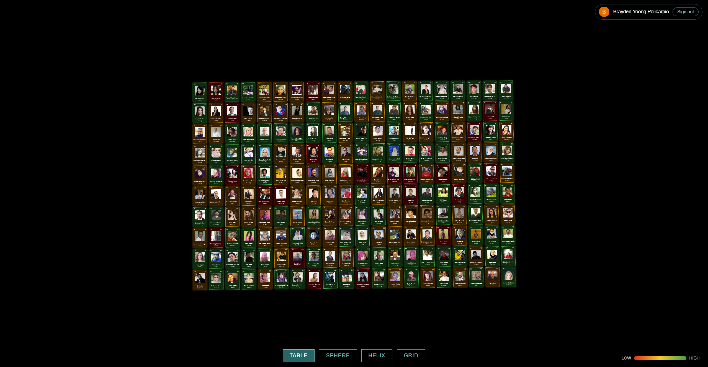
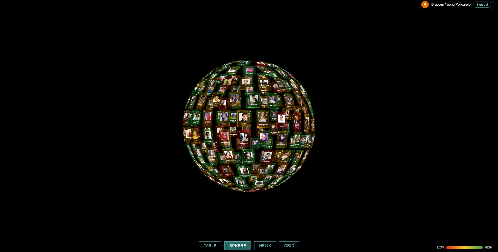
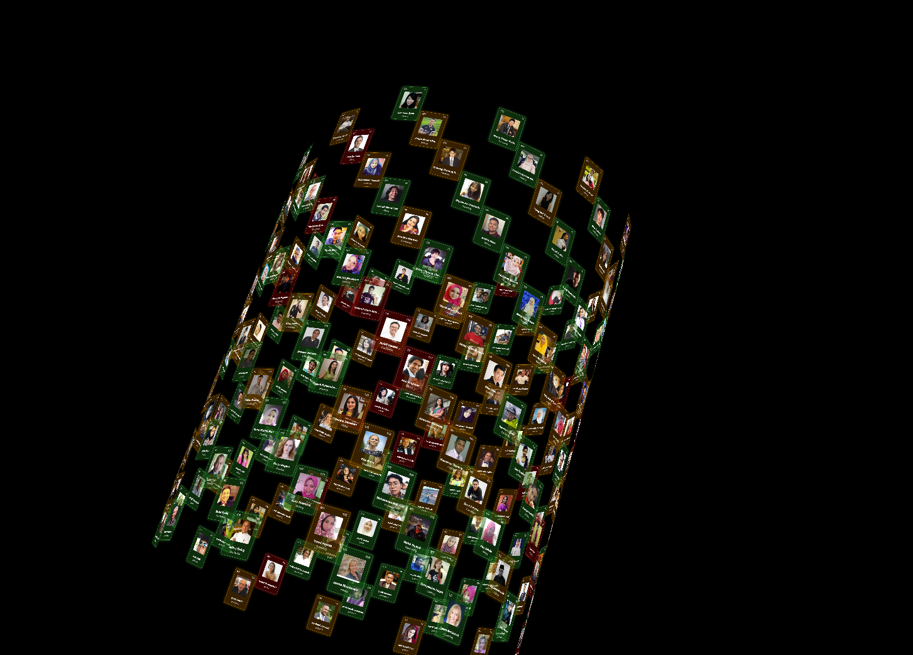
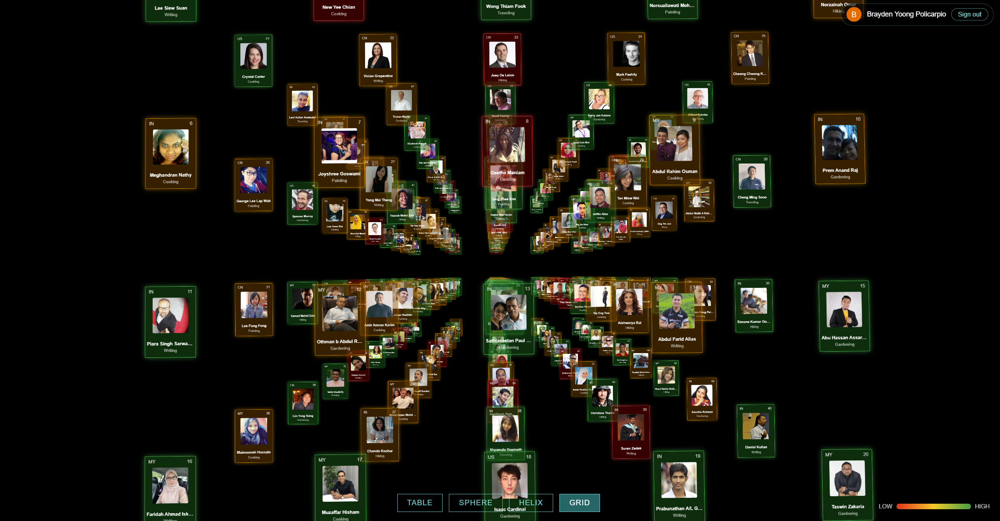

# Kasatria 3D Periodic Table — Software Developer Assignment

A 3D data visualization built on the Three.js **CSS3DRenderer**, adapted from the
official [css3d_periodictable](https://threejs.org/examples/#css3d_periodictable)
example. 200 people from a Google Sheet are rendered as tiles, color-coded by
net worth, and arranged in four animated layouts.

## 🔗 Live demo

**https://lifepain.github.io/KasatriaPeriodicTable/**

**How to review:** open the link, sign in with any Google account, then use the
buttons at the bottom (TABLE / SPHERE / HELIX / GRID) to switch layouts.
Drag to orbit, scroll to zoom.

## Screenshots

| Table (20×10) | Sphere |
|---|---|
|  |  |

| Double Helix | Grid (5×4×10) |
|---|---|
|  |  |

## Features

- **Google Sign-In gate** (Google Identity Services) — the visualization only
  loads after authentication; the signed-in user's name and avatar are shown
  with a sign-out option
- **Live data from Google Sheets** (Sheets API v4, read-only)
- **Tile design per spec:** country (top-left), rank (top-right), photo
  (center), name and interest (bottom)
- **Net worth color tiers:** Red < $100K · Orange $100K–$200K · Green > $200K,
  with a LOW→HIGH legend
- **Four layouts:** Table (20×10), Sphere, **double** Helix, Grid (5×4×10)
  with tweened transitions
- Loading spinner, descriptive error states with retry, broken-image fallback,
  responsive UI

## Architecture

```
index.html        UI shell: login gate, menu, legend, status overlays
css/style.css     Demo-faithful dark aesthetic + tier colors
js/config.js      All environment values in one place (keys, sheet ID, thresholds)
js/auth.js        GIS login flow, JWT payload decode (display only), sign-out
js/data.js        Sheets API fetch, header-tolerant parsing, net worth tiering
js/main.js        Three.js scene, tile factory, layout math, TWEEN transitions
```

Plain ES modules, no build step — deployable to any static host.

## Layout math

**Table (20×10):** `col = i % 20`, `row = floor(i / 20)`, with pitch 140×180px
and offsets that center the grid at the origin.

**Sphere:** golden-spiral distribution — `phi = acos(-1 + 2i/n)` spaces points
evenly along the vertical axis; `theta = sqrt(n·π)·phi` spirals them around it.
Each tile `lookAt`s a point radially outward so it faces away from center.

**Double helix:** tiles alternate between two strands (`strand = i % 2`). Both
strands share the same angular step and vertical drop per step, but the second
strand's angle is offset by **π (180°)** so it winds exactly opposite the
first — the classic DNA silhouette. `setFromCylindricalCoords` places tiles on
the cylinder surface, and each tile `lookAt`s a point radially outward so it
stays tangent to the cylinder.

**Grid (5×4×10):** index decomposition with mixed radix —
`x = i % 5`, `y = floor(i/5) % 4`, `z = floor(i/20)`.
5 × 4 × 10 = 200 slots = exactly the dataset size.

## Setup (reproducing this project)

1. **Google Sheet:** import the CSV, set sharing to *Anyone with the link –
   Viewer*, copy the sheet ID into `js/config.js`.
2. **Google Cloud:** enable the Sheets API; create an API key (restricted to
   the Sheets API + this site's referrers) and an OAuth Web Client ID
   (authorized JavaScript origins: localhost + the deployed origin); publish
   the OAuth consent screen.
3. **Run locally:** serve over http (GIS does not work on `file://`), e.g.
   `npx serve -l 5500`.
4. **Deploy:** push to GitHub → Settings → Pages → deploy from `main`.

## Assumptions & design notes

- The spec lists Orange **>** $100K and Green **>** $200K; boundaries are
  resolved as Red < 100K, Orange [100K, 200K], Green > 200K.
- The source CSV's ` Net Worth ` header contains stray spaces; headers are
  trimmed at parse time so the sheet never needs manual editing.
- The helix angular step and vertical pitch were increased from the demo
  defaults so the two strands are visually distinguishable as a double helix.
- `config.js` is committed intentionally: in a no-backend static app these
  values are visible to the browser regardless. The API key is protected by
  HTTP-referrer restriction and is scoped to the Sheets API only; the OAuth
  Client ID is a public identifier by design. No client secret is used or
  stored anywhere in this project.
- No framework/build step: the assignment adapts a vanilla Three.js demo, so
  vanilla ES modules keep it faithful and easy to review.